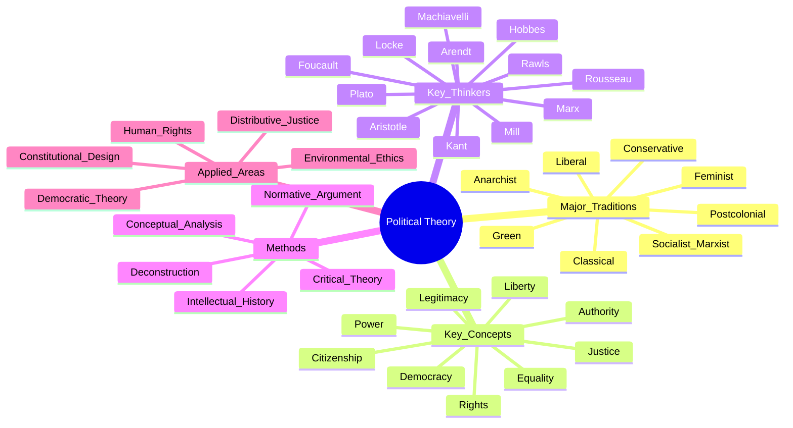

```mermaid
mindmap
  root((Political Theory))
    Major_Traditions
      Classical
      Liberal
      Conservative
      Socialist_Marxist
      Anarchist
      Feminist
      Postcolonial
      Green
    Key_Concepts
      Justice
      Liberty
      Equality
      Rights
      Power
      Authority
      Legitimacy
      Democracy
      Citizenship
    Key_Thinkers
      Plato
      Aristotle
      Machiavelli
      Hobbes
      Locke
      Rousseau
      Kant
      Marx
      Mill
      Rawls
      Arendt
      Foucault
    Methods
      Normative_Argument
      Conceptual_Analysis
      Intellectual_History
      Critical_Theory
      Deconstruction
    Applied_Areas
      Constitutional_Design
      Human_Rights
      Distributive_Justice
      Environmental_Ethics
      Democratic_Theory
```

