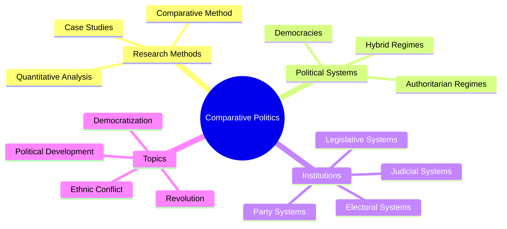

```mermaid
mindmap
  root((Comparative Politics))
    Research Methods
      Case Studies
      Comparative Method
      Quantitative Analysis
    Political Systems
      Democracies
      Authoritarian Regimes
      Hybrid Regimes
    Institutions
      Electoral Systems
      Party Systems
      Legislative Systems
      Judicial Systems
    Topics
      Democratization
      Political Development
      Ethnic Conflict
      Revolution
```

