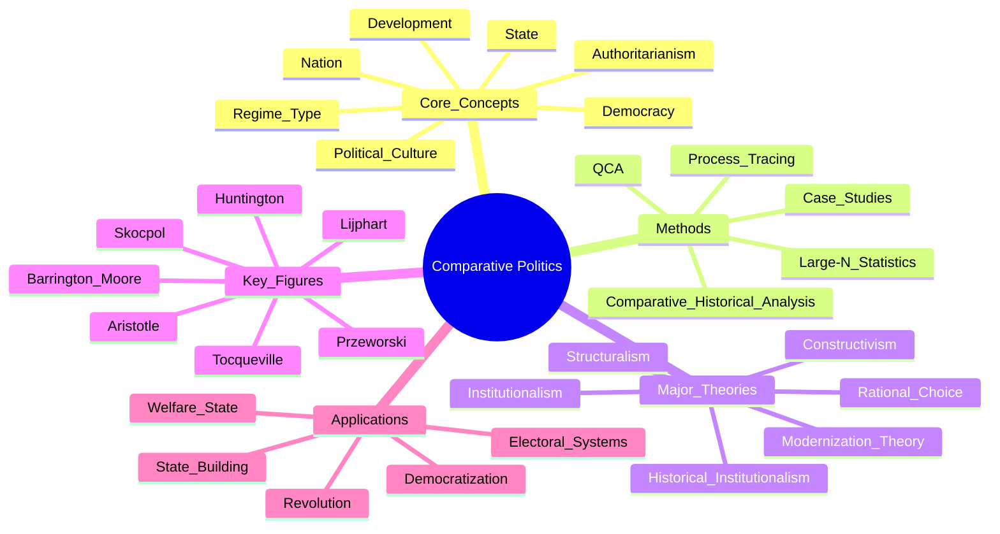

```mermaid
mindmap
  root((Comparative Politics))
    Core_Concepts
      State
      Nation
      Regime_Type
      Democracy
      Authoritarianism
      Political_Culture
      Development
    Methods
      Case_Studies
      Comparative_Historical_Analysis
      Large‑N_Statistics
      QCA
      Process_Tracing
    Major_Theories
      Modernization_Theory
      Structuralism
      Institutionalism
      Rational_Choice
      Constructivism
      Historical_Institutionalism
    Key_Figures
      Aristotle
      Tocqueville
      Barrington_Moore
      Huntington
      Skocpol
      Lijphart
      Przeworski
    Applications
      Democratization
      State_Building
      Welfare_State
      Electoral_Systems
      Revolution
```

