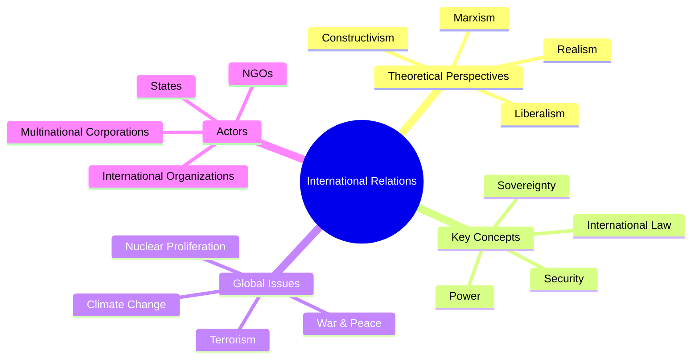

```mermaid
mindmap
  root((International Relations))
    Theoretical Perspectives
      Realism
      Liberalism
      Constructivism
      Marxism
    Key Concepts
      Power
      Security
      Sovereignty
      International Law
    Global Issues
      War & Peace
      Terrorism
      Nuclear Proliferation
      Climate Change
    Actors
      States
      International Organizations
      NGOs
      Multinational Corporations
```

