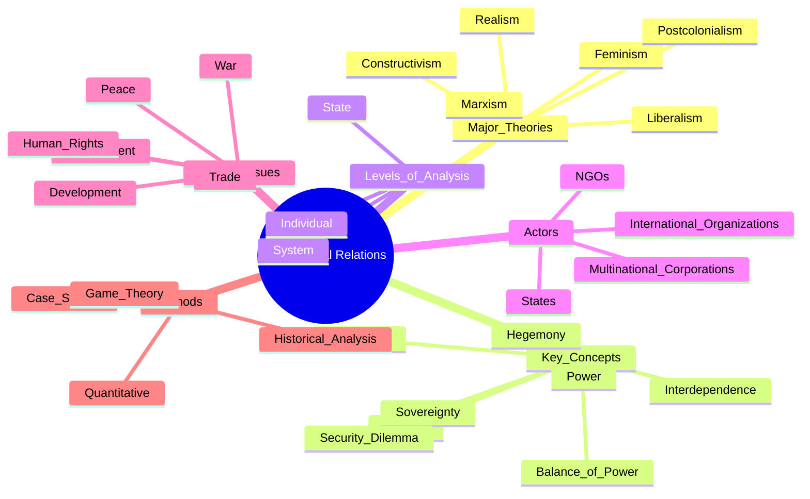

```mermaid
mindmap
  root((International Relations))
    Major_Theories
      Realism
      Liberalism
      Constructivism
      Marxism
      Feminism
      Postcolonialism
    Key_Concepts
      Anarchy
      Sovereignty
      Power
      Balance_of_Power
      Security_Dilemma
      Interdependence
      Hegemony
      Soft_Power
    Levels_of_Analysis
      System
      State
      Individual
    Actors
      States
      International_Organizations
      NGOs
      Multinational_Corporations
    Central_Issues
      War
      Peace
      Trade
      Development
      Environment
      Human_Rights
    Methods
      Historical_Analysis
      Case_Studies
      Quantitative
      Game_Theory
```

