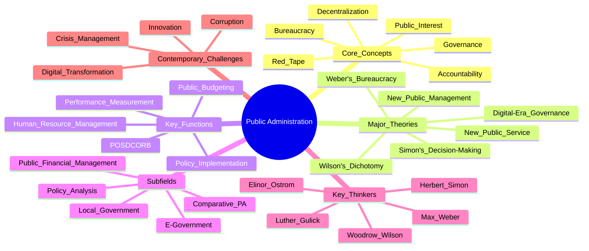

```mermaid
mindmap
  root((Public Administration))
    Core_Concepts
      Public_Interest
      Accountability
      Bureaucracy
      Red_Tape
      Decentralization
      Governance
    Major_Theories
      Wilson's_Dichotomy
      Weber's_Bureaucracy
      Simon's_Decision-Making
      New_Public_Management
      New_Public_Service
      Digital-Era_Governance
    Key_Functions
      POSDCORB
      Policy_Implementation
      Public_Budgeting
      Human_Resource_Management
      Performance_Measurement
    Subfields
      Comparative_PA
      Policy_Analysis
      Public_Financial_Management
      E-Government
      Local_Government
    Key_Thinkers
      Woodrow_Wilson
      Max_Weber
      Luther_Gulick
      Herbert_Simon
      Elinor_Ostrom
    Contemporary_Challenges
      Corruption
      Innovation
      Crisis_Management
      Digital_Transformation
```

