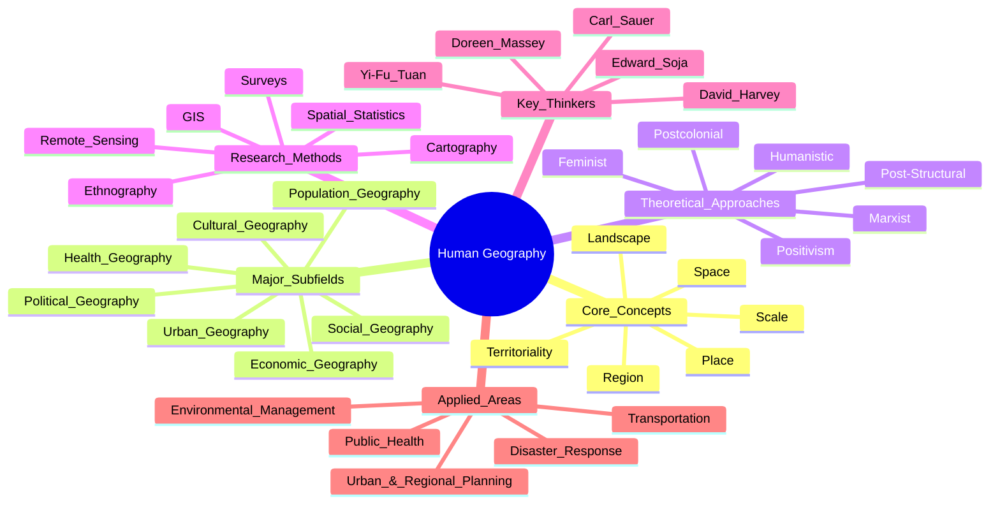

```mermaid
mindmap
  root((Human Geography))
    Core_Concepts
      Space
      Place
      Scale
      Region
      Landscape
      Territoriality
    Major_Subfields
      Cultural_Geography
      Economic_Geography
      Political_Geography
      Urban_Geography
      Social_Geography
      Population_Geography
      Health_Geography
    Theoretical_Approaches
      Positivism
      Humanistic
      Marxist
      Feminist
      Post-Structural
      Postcolonial
    Research_Methods
      GIS
      Cartography
      Remote_Sensing
      Ethnography
      Surveys
      Spatial_Statistics
    Key_Thinkers
      Carl_Sauer
      David_Harvey
      Doreen_Massey
      Yi-Fu_Tuan
      Edward_Soja
    Applied_Areas
      Urban_&_Regional_Planning
      Environmental_Management
      Transportation
      Disaster_Response
      Public_Health
```

