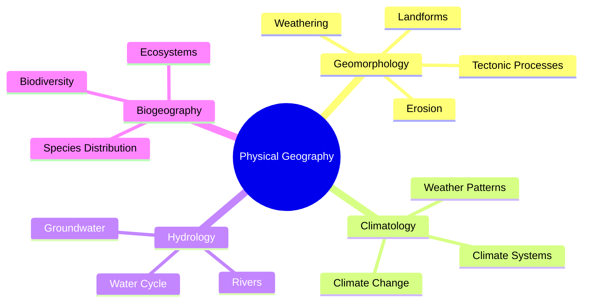

```mermaid
mindmap
  root((Physical Geography))
    Geomorphology
      Landforms
      Erosion
      Weathering
      Tectonic Processes
    Climatology
      Climate Systems
      Climate Change
      Weather Patterns
    Hydrology
      Water Cycle
      Rivers
      Groundwater
    Biogeography
      Ecosystems
      Species Distribution
      Biodiversity
```

