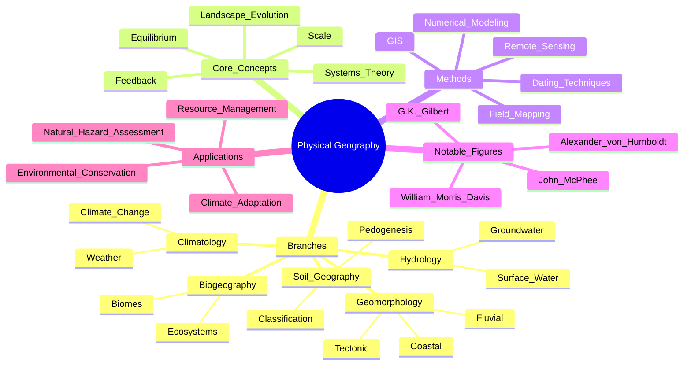

```mermaid
mindmap
  root((Physical Geography))
    Branches
      Geomorphology
        Tectonic
        Fluvial
        Coastal
      Climatology
        Weather
        Climate_Change
      Biogeography
        Ecosystems
        Biomes
      Hydrology
        Surface_Water
        Groundwater
      Soil_Geography
        Pedogenesis
        Classification
    Core_Concepts
      Systems_Theory
      Feedback
      Equilibrium
      Landscape_Evolution
      Scale
    Methods
      Field_Mapping
      Remote_Sensing
      GIS
      Numerical_Modeling
      Dating_Techniques
    Notable_Figures
      Alexander_von_Humboldt
      William_Morris_Davis
      G.K._Gilbert
      John_McPhee
    Applications
      Natural_Hazard_Assessment
      Environmental_Conservation
      Climate_Adaptation
      Resource_Management
```

