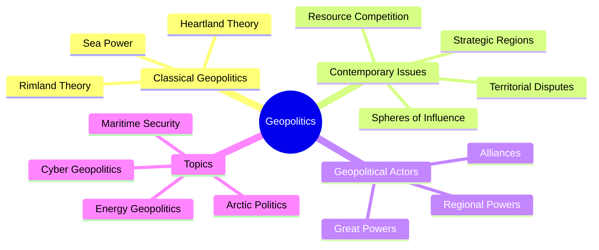

```mermaid
mindmap
  root((Geopolitics))
    Classical Geopolitics
      Heartland Theory
      Rimland Theory
      Sea Power
    Contemporary Issues
      Resource Competition
      Territorial Disputes
      Strategic Regions
      Spheres of Influence
    Geopolitical Actors
      Great Powers
      Regional Powers
      Alliances
    Topics
      Energy Geopolitics
      Arctic Politics
      Maritime Security
      Cyber Geopolitics
```

