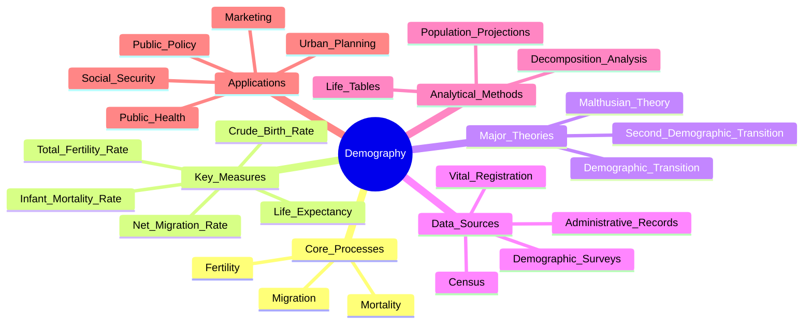

```mermaid
mindmap
  root((Demography))
    Core_Processes
      Fertility
      Mortality
      Migration
    Key_Measures
      Crude_Birth_Rate
      Total_Fertility_Rate
      Life_Expectancy
      Infant_Mortality_Rate
      Net_Migration_Rate
    Major_Theories
      Malthusian_Theory
      Demographic_Transition
      Second_Demographic_Transition
    Data_Sources
      Census
      Vital_Registration
      Demographic_Surveys
      Administrative_Records
    Analytical_Methods
      Life_Tables
      Population_Projections
      Decomposition_Analysis
    Applications
      Public_Policy
      Social_Security
      Urban_Planning
      Public_Health
      Marketing
```

