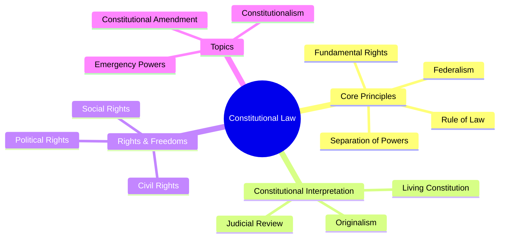

```mermaid
mindmap
  root((Constitutional Law))
    Core Principles
      Separation of Powers
      Rule of Law
      Fundamental Rights
      Federalism
    Constitutional Interpretation
      Originalism
      Living Constitution
      Judicial Review
    Rights & Freedoms
      Civil Rights
      Political Rights
      Social Rights
    Topics
      Constitutional Amendment
      Emergency Powers
      Constitutionalism
```

