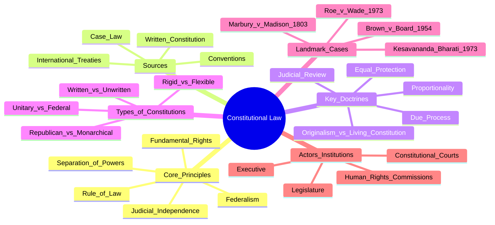

```mermaid
mindmap
  root((Constitutional Law))
    Core_Principles
      Rule_of_Law
      Separation_of_Powers
      Federalism
      Judicial_Independence
      Fundamental_Rights
    Sources
      Written_Constitution
      Case_Law
      Conventions
      International_Treaties
    Key_Doctrines
      Judicial_Review
      Due_Process
      Equal_Protection
      Proportionality
      Originalism_vs_Living_Constitution
    Types_of_Constitutions
      Written_vs_Unwritten
      Rigid_vs_Flexible
      Unitary_vs_Federal
      Republican_vs_Monarchical
    Landmark_Cases
      Marbury_v_Madison_1803
      Brown_v_Board_1954
      Roe_v_Wade_1973
      Kesavananda_Bharati_1973
    Actors_Institutions
      Constitutional_Courts
      Legislature
      Executive
      Human_Rights_Commissions
```

