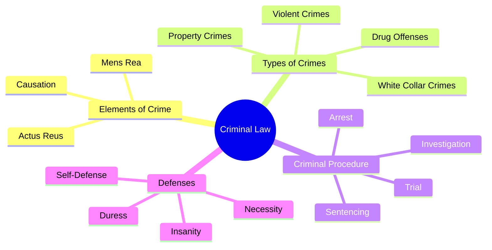

```mermaid
mindmap
  root((Criminal Law))
    Elements of Crime
      Actus Reus
      Mens Rea
      Causation
    Types of Crimes
      Violent Crimes
      Property Crimes
      White Collar Crimes
      Drug Offenses
    Criminal Procedure
      Investigation
      Arrest
      Trial
      Sentencing
    Defenses
      Self-Defense
      Insanity
      Duress
      Necessity
```

