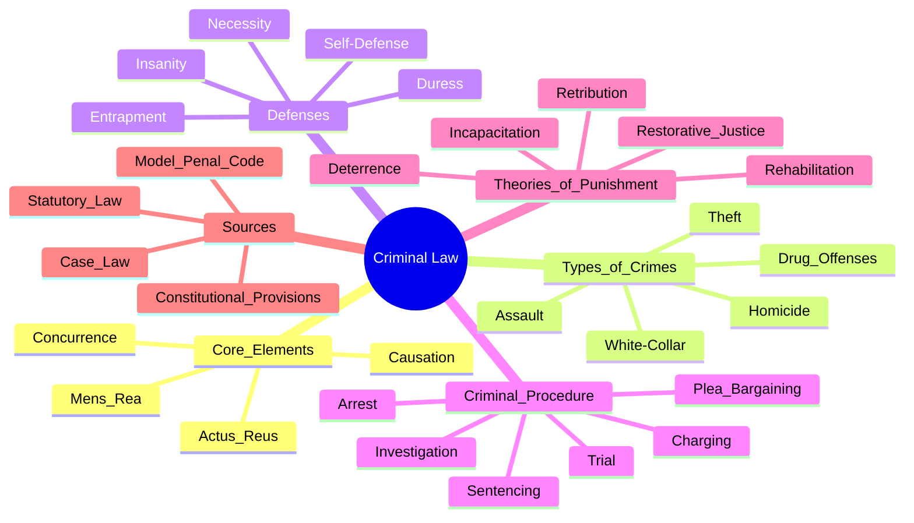

```mermaid
mindmap
  root((Criminal Law))
    Core_Elements
      Actus_Reus
      Mens_Rea
      Concurrence
      Causation
    Types_of_Crimes
      Homicide
      Theft
      Assault
      Drug_Offenses
      White‑Collar
    Defenses
      Self‑Defense
      Insanity
      Duress
      Necessity
      Entrapment
    Criminal_Procedure
      Investigation
      Arrest
      Charging
      Plea_Bargaining
      Trial
      Sentencing
    Theories_of_Punishment
      Retribution
      Deterrence
      Incapacitation
      Rehabilitation
      Restorative_Justice
    Sources
      Statutory_Law
      Case_Law
      Model_Penal_Code
      Constitutional_Provisions
```

