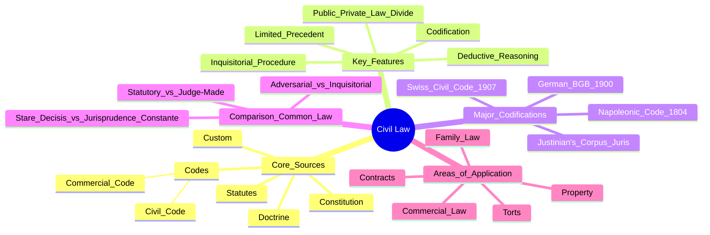

```mermaid
mindmap
  root((Civil Law))
    Core_Sources
      Constitution
      Codes
        Civil_Code
        Commercial_Code
      Statutes
      Custom
      Doctrine
    Key_Features
      Codification
      Deductive_Reasoning
      Limited_Precedent
      Inquisitorial_Procedure
      Public_Private_Law_Divide
    Major_Codifications
      Justinian's_Corpus_Juris
      Napoleonic_Code_1804
      German_BGB_1900
      Swiss_Civil_Code_1907
    Comparison_Common_Law
      Statutory_vs_Judge‑Made
      Adversarial_vs_Inquisitorial
      Stare_Decisis_vs_Jurisprudence_Constante
    Areas_of_Application
      Contracts
      Torts
      Property
      Family_Law
      Commercial_Law
```

