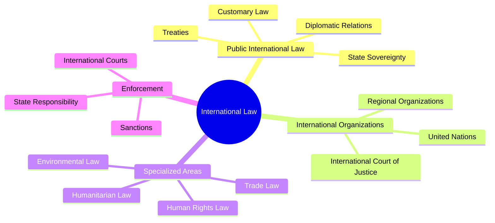

```mermaid
mindmap
  root((International Law))
    Public International Law
      Treaties
      Customary Law
      State Sovereignty
      Diplomatic Relations
    International Organizations
      United Nations
      International Court of Justice
      Regional Organizations
    Specialized Areas
      Human Rights Law
      Humanitarian Law
      Environmental Law
      Trade Law
    Enforcement
      Sanctions
      International Courts
      State Responsibility
```

