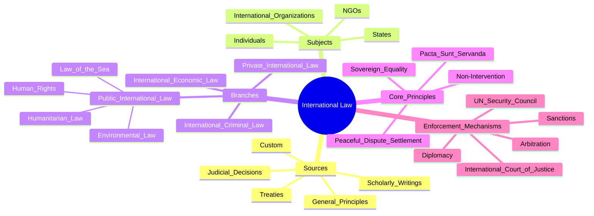

```mermaid
mindmap
  root((International Law))
    Sources
      Treaties
      Custom
      General_Principles
      Judicial_Decisions
      Scholarly_Writings
    Subjects
      States
      International_Organizations
      Individuals
      NGOs
    Branches
      Public_International_Law
        Law_of_the_Sea
        Humanitarian_Law
        Human_Rights
        Environmental_Law
      Private_International_Law
      International_Criminal_Law
      International_Economic_Law
    Core_Principles
      Sovereign_Equality
      Non‑Intervention
      Pacta_Sunt_Servanda
      Peaceful_Dispute_Settlement
    Enforcement_Mechanisms
      International_Court_of_Justice
      Arbitration
      UN_Security_Council
      Sanctions
      Diplomacy
```

