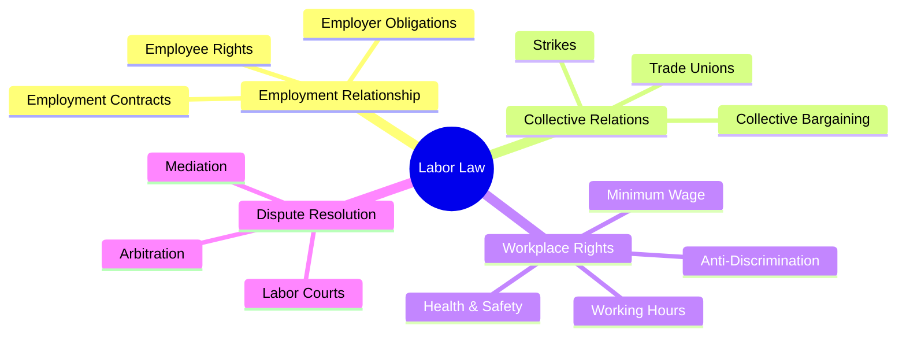

```mermaid
mindmap
  root((Labor Law))
    Employment Relationship
      Employment Contracts
      Employee Rights
      Employer Obligations
    Collective Relations
      Trade Unions
      Collective Bargaining
      Strikes
    Workplace Rights
      Minimum Wage
      Working Hours
      Health & Safety
      Anti-Discrimination
    Dispute Resolution
      Labor Courts
      Arbitration
      Mediation
```

