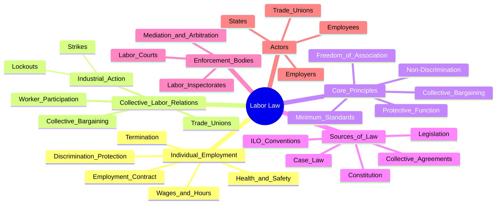

```mermaid
mindmap
  root((Labor Law))
    Individual_Employment
      Employment_Contract
      Wages_and_Hours
      Health_and_Safety
      Discrimination_Protection
      Termination
    Collective_Labor_Relations
      Trade_Unions
      Collective_Bargaining
      Industrial_Action
        Strikes
        Lockouts
      Worker_Participation
    Core_Principles
      Protective_Function
      Non‑Discrimination
      Freedom_of_Association
      Collective_Bargaining
      Minimum_Standards
    Sources_of_Law
      Constitution
      Legislation
      Collective_Agreements
      ILO_Conventions
      Case_Law
    Enforcement_Bodies
      Labor_Inspectorates
      Labor_Courts
      Mediation_and_Arbitration
    Actors
      Employees
      Employers
      Trade_Unions
      States
```

