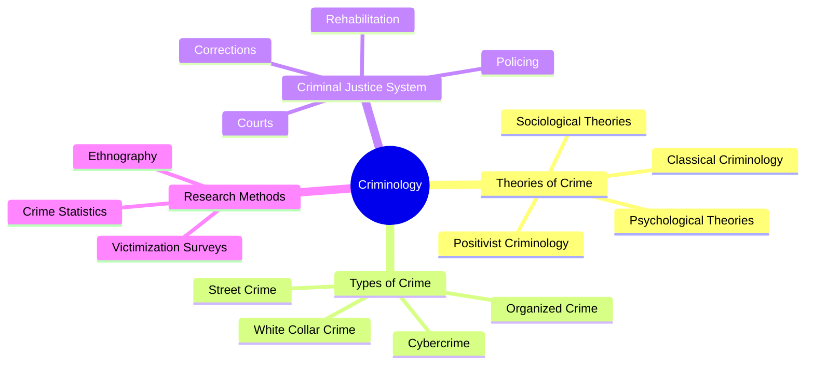

```mermaid
mindmap
  root((Criminology))
    Theories of Crime
      Classical Criminology
      Positivist Criminology
      Sociological Theories
      Psychological Theories
    Types of Crime
      Street Crime
      White Collar Crime
      Organized Crime
      Cybercrime
    Criminal Justice System
      Policing
      Courts
      Corrections
      Rehabilitation
    Research Methods
      Crime Statistics
      Victimization Surveys
      Ethnography
```

