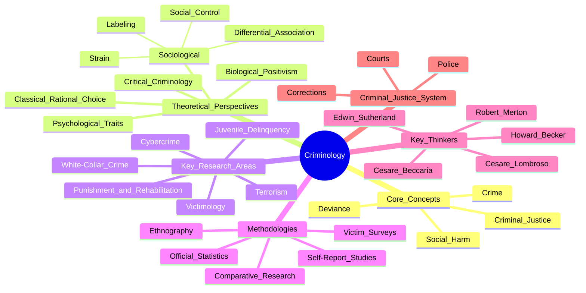

```mermaid
mindmap
  root((Criminology))
    Core_Concepts
      Crime
      Deviance
      Criminal_Justice
      Social_Harm
    Theoretical_Perspectives
      Classical_Rational_Choice
      Biological_Positivism
      Psychological_Traits
      Sociological
        Strain
        Differential_Association
        Social_Control
        Labeling
      Critical_Criminology
    Key_Research_Areas
      Victimology
      Juvenile_Delinquency
      White‑Collar_Crime
      Cybercrime
      Terrorism
      Punishment_and_Rehabilitation
    Methodologies
      Victim_Surveys
      Self‑Report_Studies
      Official_Statistics
      Ethnography
      Comparative_Research
    Key_Thinkers
      Cesare_Beccaria
      Cesare_Lombroso
      Edwin_Sutherland
      Robert_Merton
      Howard_Becker
    Criminal_Justice_System
      Police
      Courts
      Corrections
```

