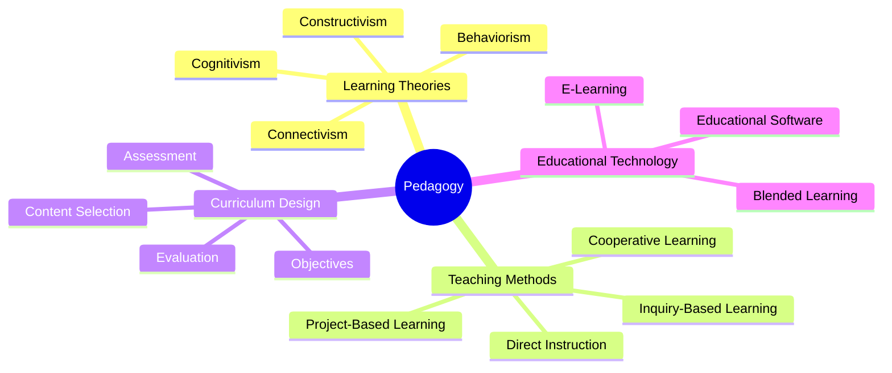

```mermaid
mindmap
  root((Pedagogy))
    Learning Theories
      Behaviorism
      Cognitivism
      Constructivism
      Connectivism
    Teaching Methods
      Direct Instruction
      Inquiry-Based Learning
      Cooperative Learning
      Project-Based Learning
    Curriculum Design
      Objectives
      Content Selection
      Assessment
      Evaluation
    Educational Technology
      E-Learning
      Blended Learning
      Educational Software
```

