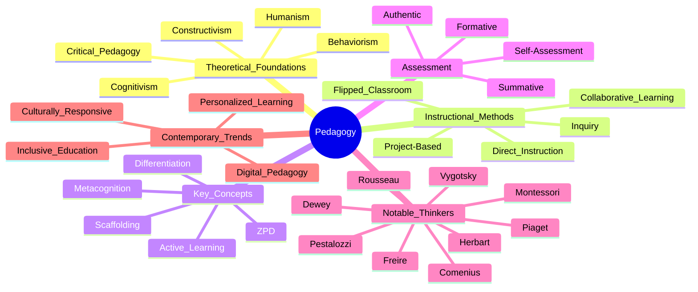

```mermaid
mindmap
  root((Pedagogy))
    Theoretical_Foundations
      Behaviorism
      Cognitivism
      Constructivism
      Humanism
      Critical_Pedagogy
    Instructional_Methods
      Direct_Instruction
      Collaborative_Learning
      Project‑Based
      Inquiry
      Flipped_Classroom
    Key_Concepts
      Scaffolding
      ZPD
      Differentiation
      Active_Learning
      Metacognition
    Assessment
      Formative
      Summative
      Authentic
      Self-Assessment
    Notable_Thinkers
      Comenius
      Rousseau
      Pestalozzi
      Herbart
      Dewey
      Montessori
      Piaget
      Vygotsky
      Freire
    Contemporary_Trends
      Digital_Pedagogy
      Inclusive_Education
      Culturally_Responsive
      Personalized_Learning
```

