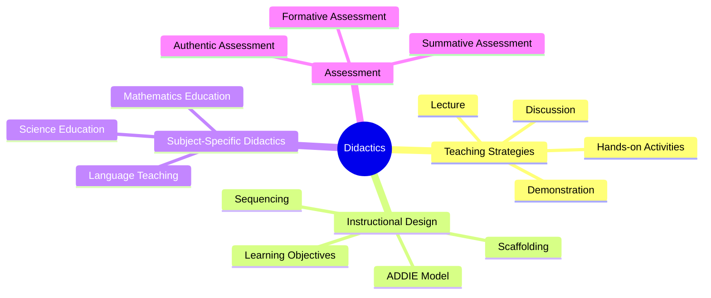

```mermaid
mindmap
  root((Didactics))
    Teaching Strategies
      Lecture
      Discussion
      Demonstration
      Hands-on Activities
    Instructional Design
      ADDIE Model
      Learning Objectives
      Sequencing
      Scaffolding
    Subject-Specific Didactics
      Mathematics Education
      Science Education
      Language Teaching
    Assessment
      Formative Assessment
      Summative Assessment
      Authentic Assessment
```

