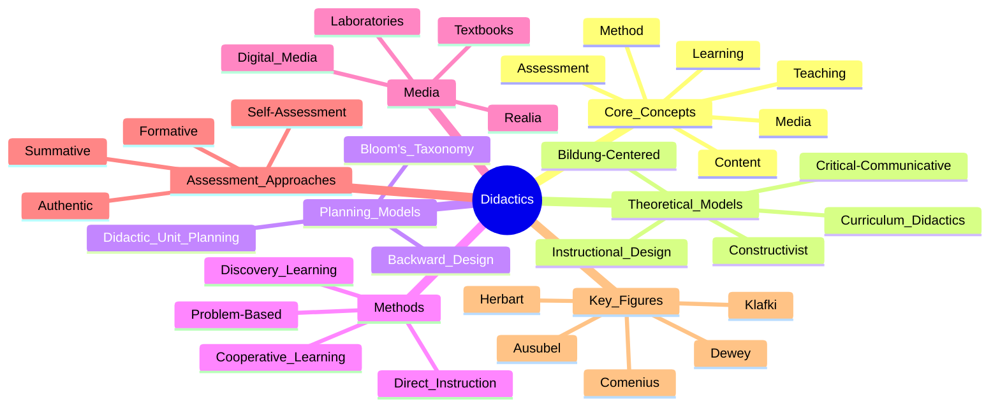

```mermaid
mindmap
  root((Didactics))
    Core_Concepts
      Teaching
      Learning
      Content
      Method
      Media
      Assessment
    Theoretical_Models
      Bildung‑Centered
      Constructivist
      Critical‑Communicative
      Curriculum_Didactics
      Instructional_Design
    Planning_Models
      Bloom's_Taxonomy
      Backward_Design
      Didactic_Unit_Planning
    Methods
      Direct_Instruction
      Discovery_Learning
      Cooperative_Learning
      Problem‑Based
    Media
      Textbooks
      Digital_Media
      Laboratories
      Realia
    Assessment_Approaches
      Formative
      Summative
      Authentic
      Self‑Assessment
    Key_Figures
      Comenius
      Herbart
      Dewey
      Klafki
      Ausubel
```

