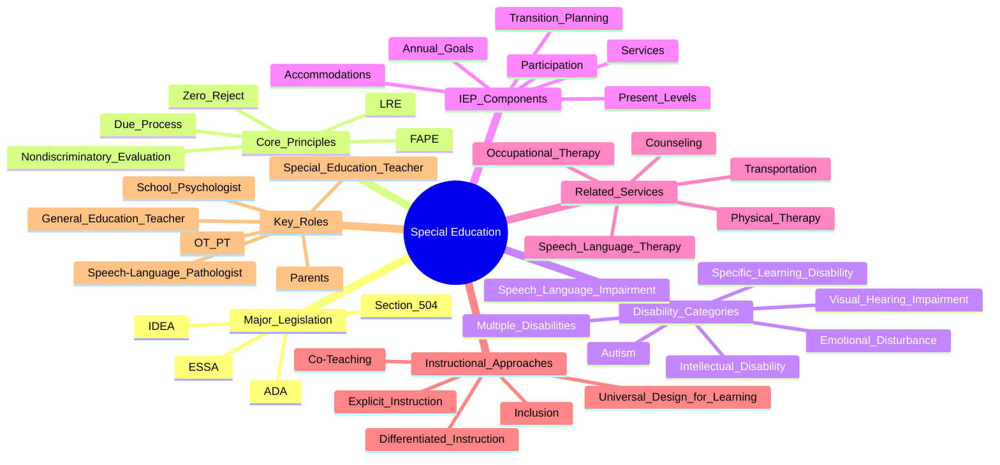

```mermaid
mindmap
  root((Special Education))
    Major_Legislation
      IDEA
      Section_504
      ADA
      ESSA
    Core_Principles
      FAPE
      LRE
      Due_Process
      Zero_Reject
      Nondiscriminatory_Evaluation
    Disability_Categories
      Autism
      Intellectual_Disability
      Specific_Learning_Disability
      Emotional_Disturbance
      Speech_Language_Impairment
      Visual_Hearing_Impairment
      Multiple_Disabilities
    IEP_Components
      Present_Levels
      Annual_Goals
      Services
      Accommodations
      Participation
      Transition_Planning
    Related_Services
      Speech_Language_Therapy
      Occupational_Therapy
      Physical_Therapy
      Counseling
      Transportation
    Instructional_Approaches
      Differentiated_Instruction
      Universal_Design_for_Learning
      Co‑Teaching
      Inclusion
      Explicit_Instruction
    Key_Roles
      Special_Education_Teacher
      General_Education_Teacher
      School_Psychologist
      Speech‑Language_Pathologist
      OT_PT
      Parents
```

