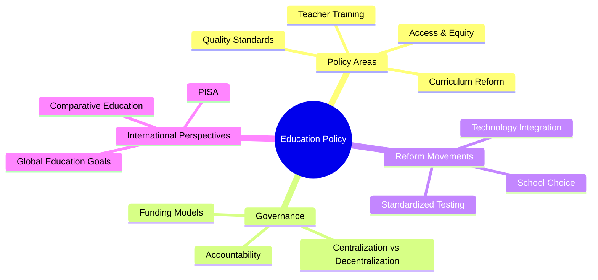

```mermaid
mindmap
  root((Education Policy))
    Policy Areas
      Access & Equity
      Quality Standards
      Curriculum Reform
      Teacher Training
    Governance
      Centralization vs Decentralization
      Accountability
      Funding Models
    Reform Movements
      School Choice
      Standardized Testing
      Technology Integration
    International Perspectives
      Comparative Education
      PISA
      Global Education Goals
```

