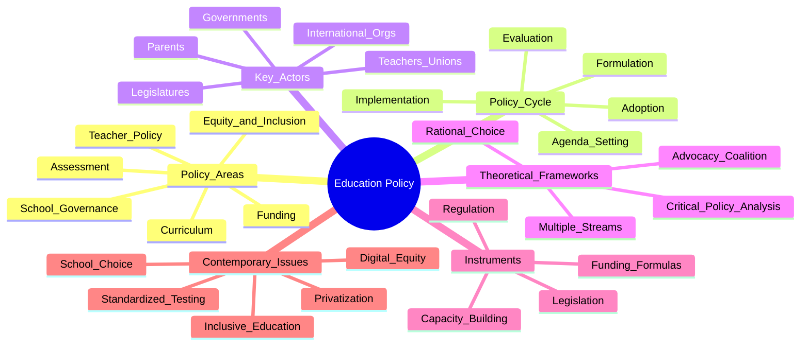

```mermaid
mindmap
  root((Education Policy))
    Policy_Areas
      Funding
      Curriculum
      Teacher_Policy
      Assessment
      Equity_and_Inclusion
      School_Governance
    Policy_Cycle
      Agenda_Setting
      Formulation
      Adoption
      Implementation
      Evaluation
    Key_Actors
      Governments
      Legislatures
      Teachers_Unions
      Parents
      International_Orgs
    Theoretical_Frameworks
      Rational_Choice
      Multiple_Streams
      Advocacy_Coalition
      Critical_Policy_Analysis
    Instruments
      Legislation
      Funding_Formulas
      Regulation
      Capacity_Building
    Contemporary_Issues
      Privatization
      School_Choice
      Digital_Equity
      Standardized_Testing
      Inclusive_Education
```

