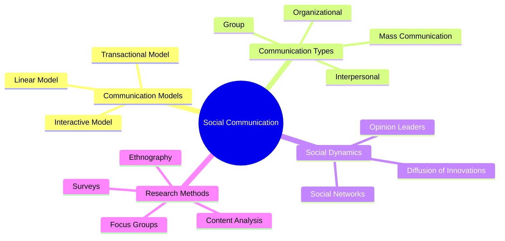

```mermaid
mindmap
  root((Social Communication))
    Communication Models
      Linear Model
      Interactive Model
      Transactional Model
    Communication Types
      Interpersonal
      Group
      Organizational
      Mass Communication
    Social Dynamics
      Social Networks
      Opinion Leaders
      Diffusion of Innovations
    Research Methods
      Content Analysis
      Surveys
      Focus Groups
      Ethnography
```

