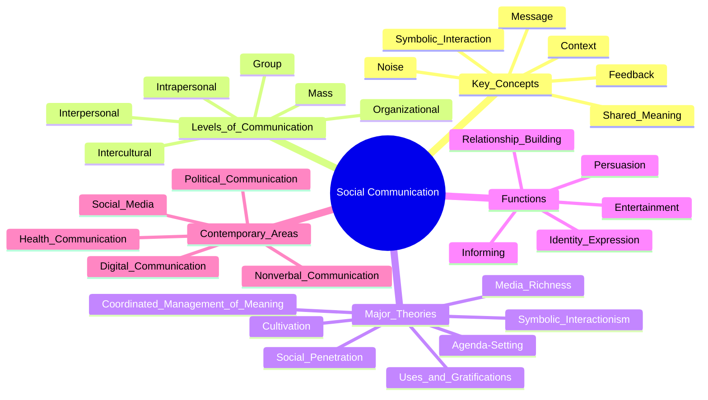

```mermaid
mindmap
  root((Social Communication))
    Key_Concepts
      Message
      Feedback
      Noise
      Context
      Shared_Meaning
      Symbolic_Interaction
    Levels_of_Communication
      Intrapersonal
      Interpersonal
      Group
      Organizational
      Mass
      Intercultural
    Major_Theories
      Symbolic_Interactionism
      Coordinated_Management_of_Meaning
      Social_Penetration
      Media_Richness
      Uses_and_Gratifications
      Agenda‑Setting
      Cultivation
    Functions
      Informing
      Relationship_Building
      Identity_Expression
      Persuasion
      Entertainment
    Contemporary_Areas
      Digital_Communication
      Social_Media
      Health_Communication
      Political_Communication
      Nonverbal_Communication
```

