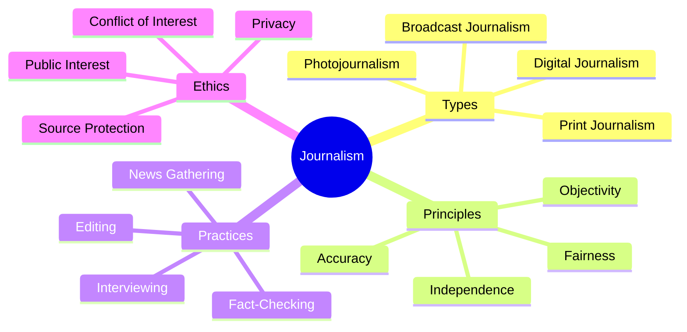

```mermaid
mindmap
  root((Journalism))
    Types
      Print Journalism
      Broadcast Journalism
      Digital Journalism
      Photojournalism
    Principles
      Accuracy
      Objectivity
      Fairness
      Independence
    Practices
      News Gathering
      Interviewing
      Fact-Checking
      Editing
    Ethics
      Source Protection
      Conflict of Interest
      Privacy
      Public Interest
```

