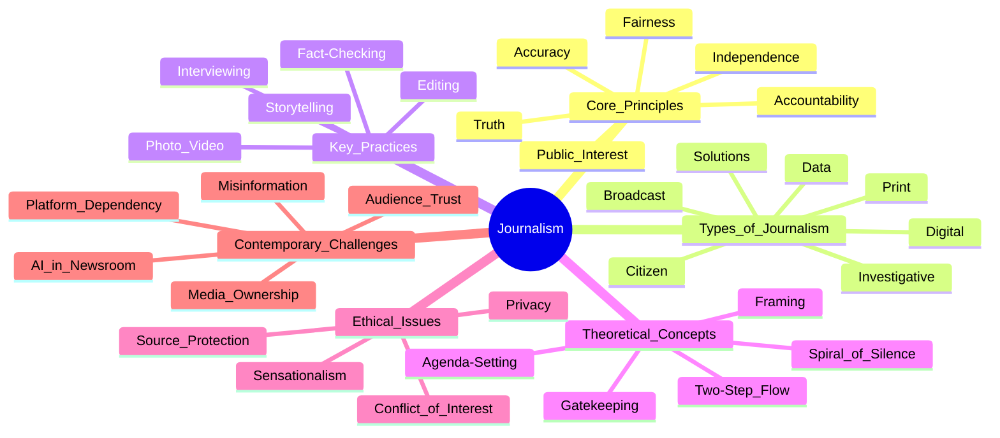

```mermaid
mindmap
  root((Journalism))
    Core_Principles
      Truth
      Accuracy
      Fairness
      Independence
      Accountability
      Public_Interest
    Types_of_Journalism
      Investigative
      Data
      Broadcast
      Print
      Digital
      Solutions
      Citizen
    Key_Practices
      Interviewing
      Fact‑Checking
      Editing
      Storytelling
      Photo_Video
    Theoretical_Concepts
      Gatekeeping
      Agenda‑Setting
      Framing
      Two‑Step_Flow
      Spiral_of_Silence
    Ethical_Issues
      Privacy
      Conflict_of_Interest
      Source_Protection
      Sensationalism
    Contemporary_Challenges
      Misinformation
      Media_Ownership
      Platform_Dependency
      AI_in_Newsroom
      Audience_Trust
```

