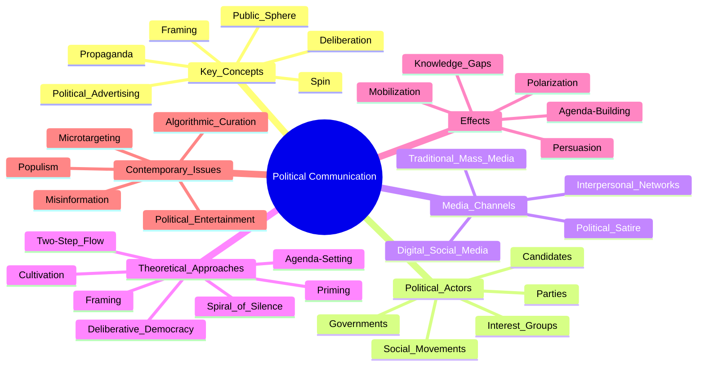

```mermaid
mindmap
  root((Political Communication))
    Key_Concepts
      Propaganda
      Public_Sphere
      Political_Advertising
      Spin
      Framing
      Deliberation
    Political_Actors
      Candidates
      Parties
      Governments
      Interest_Groups
      Social_Movements
    Media_Channels
      Traditional_Mass_Media
      Digital_Social_Media
      Interpersonal_Networks
      Political_Satire
    Theoretical_Approaches
      Agenda‑Setting
      Priming
      Framing
      Spiral_of_Silence
      Two‑Step_Flow
      Cultivation
      Deliberative_Democracy
    Effects
      Persuasion
      Agenda‑Building
      Polarization
      Mobilization
      Knowledge_Gaps
    Contemporary_Issues
      Misinformation
      Algorithmic_Curation
      Microtargeting
      Populism
      Political_Entertainment
```

