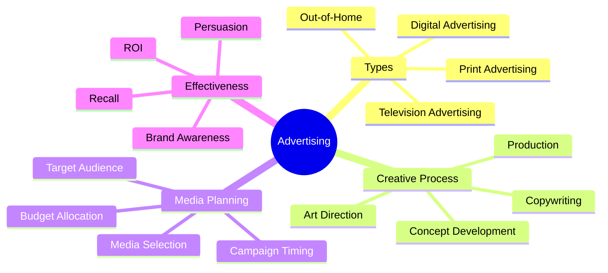

```mermaid
mindmap
  root((Advertising))
    Types
      Print Advertising
      Television Advertising
      Digital Advertising
      Out-of-Home
    Creative Process
      Concept Development
      Copywriting
      Art Direction
      Production
    Media Planning
      Target Audience
      Media Selection
      Budget Allocation
      Campaign Timing
    Effectiveness
      Brand Awareness
      Recall
      Persuasion
      ROI
```

