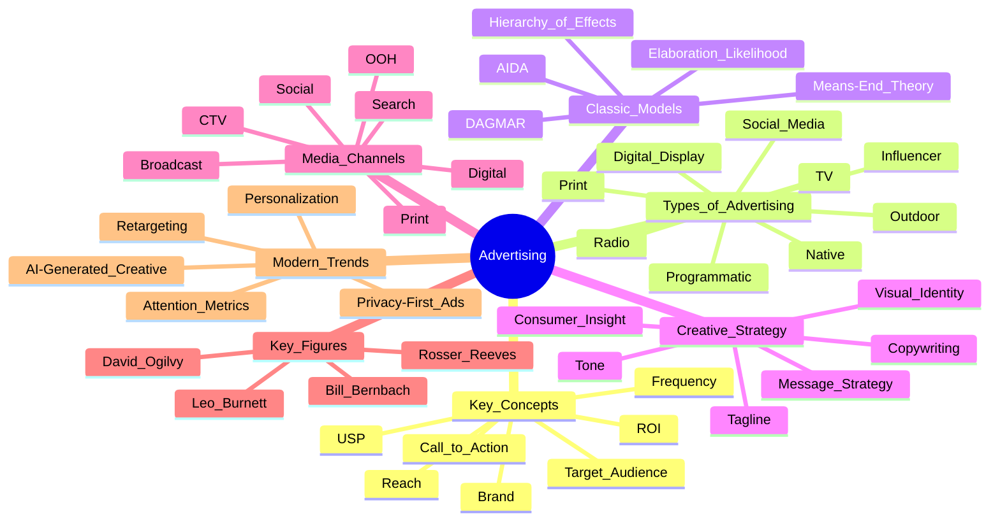

```mermaid
mindmap
  root((Advertising))
    Key_Concepts
      Target_Audience
      Brand
      USP
      Reach
      Frequency
      ROI
      Call_to_Action
    Types_of_Advertising
      TV
      Radio
      Print
      Outdoor
      Digital_Display
      Social_Media
      Native
      Influencer
      Programmatic
    Classic_Models
      AIDA
      DAGMAR
      Elaboration_Likelihood
      Hierarchy_of_Effects
      Means‑End_Theory
    Creative_Strategy
      Consumer_Insight
      Message_Strategy
      Tone
      Tagline
      Visual_Identity
      Copywriting
    Media_Channels
      Broadcast
      Print
      OOH
      Digital
      Search
      Social
      CTV
    Key_Figures
      David_Ogilvy
      Bill_Bernbach
      Rosser_Reeves
      Leo_Burnett
    Modern_Trends
      Personalization
      AI‑Generated_Creative
      Retargeting
      Privacy‑First_Ads
      Attention_Metrics
```

