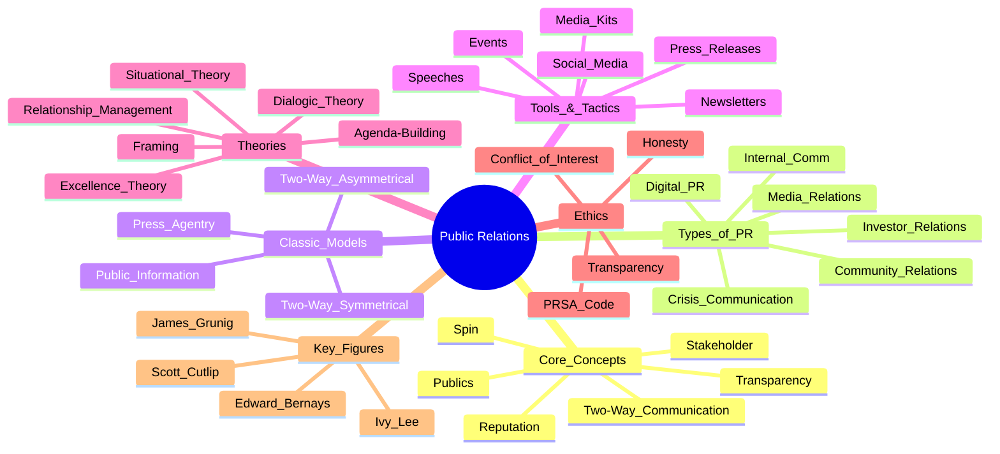

```mermaid
mindmap
  root((Public Relations))
    Core_Concepts
      Reputation
      Stakeholder
      Publics
      Two‑Way_Communication
      Transparency
      Spin
    Types_of_PR
      Media_Relations
      Crisis_Communication
      Internal_Comm
      Investor_Relations
      Community_Relations
      Digital_PR
    Classic_Models
      Press_Agentry
      Public_Information
      Two‑Way_Asymmetrical
      Two‑Way_Symmetrical
    Tools_&_Tactics
      Press_Releases
      Media_Kits
      Speeches
      Events
      Social_Media
      Newsletters
    Theories
      Excellence_Theory
      Situational_Theory
      Framing
      Agenda‑Building
      Dialogic_Theory
      Relationship_Management
    Ethics
      PRSA_Code
      Transparency
      Honesty
      Conflict_of_Interest
    Key_Figures
      Ivy_Lee
      Edward_Bernays
      James_Grunig
      Scott_Cutlip
```

