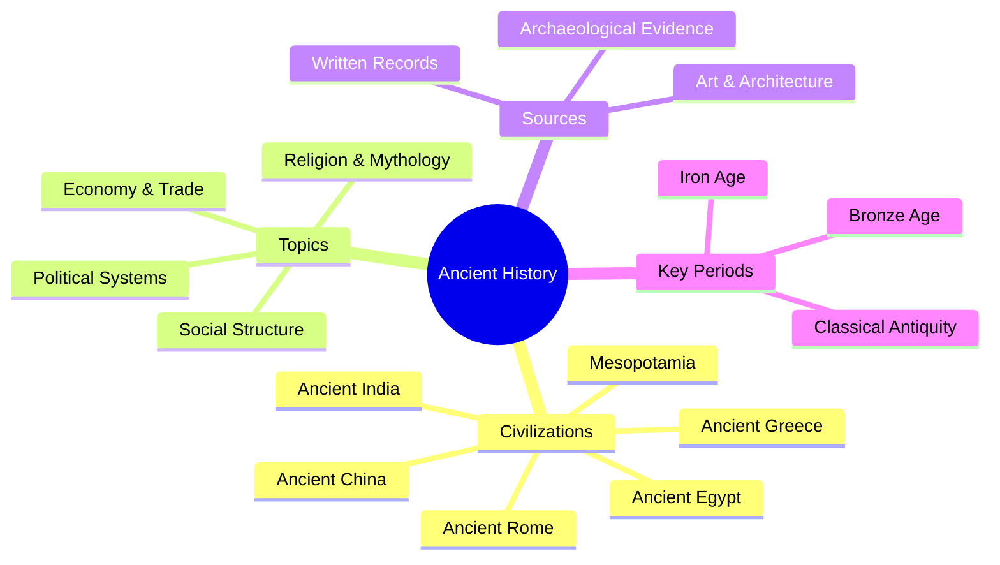

```mermaid
mindmap
  root((Ancient History))
    Civilizations
      Mesopotamia
      Ancient Egypt
      Ancient Greece
      Ancient Rome
      Ancient China
      Ancient India
    Topics
      Political Systems
      Social Structure
      Economy & Trade
      Religion & Mythology
    Sources
      Archaeological Evidence
      Written Records
      Art & Architecture
    Key Periods
      Bronze Age
      Iron Age
      Classical Antiquity
```

