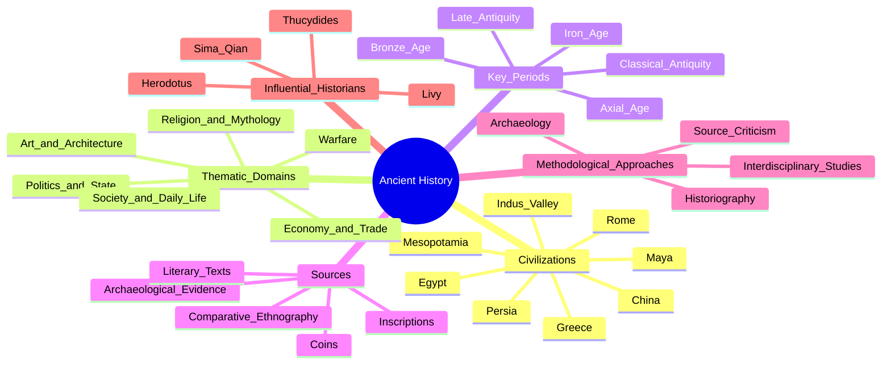

```mermaid
mindmap
  root((Ancient History))
    Civilizations
      Mesopotamia
      Egypt
      Indus_Valley
      China
      Greece
      Rome
      Persia
      Maya
    Thematic_Domains
      Politics_and_State
      Economy_and_Trade
      Society_and_Daily_Life
      Religion_and_Mythology
      Art_and_Architecture
      Warfare
    Key_Periods
      Bronze_Age
      Iron_Age
      Axial_Age
      Classical_Antiquity
      Late_Antiquity
    Sources
      Archaeological_Evidence
      Literary_Texts
      Inscriptions
      Coins
      Comparative_Ethnography
    Methodological_Approaches
      Historiography
      Source_Criticism
      Archaeology
      Interdisciplinary_Studies
    Influential_Historians
      Herodotus
      Thucydides
      Sima_Qian
      Livy
```

