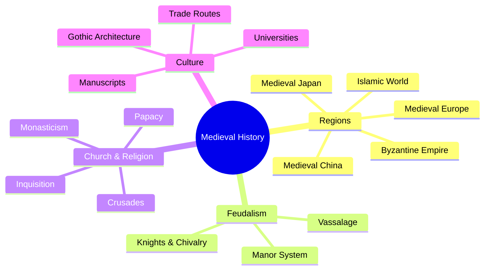

```mermaid
mindmap
  root((Medieval History))
    Regions
      Medieval Europe
      Byzantine Empire
      Islamic World
      Medieval China
      Medieval Japan
    Feudalism
      Manor System
      Vassalage
      Knights & Chivalry
    Church & Religion
      Papacy
      Monasticism
      Crusades
      Inquisition
    Culture
      Universities
      Gothic Architecture
      Manuscripts
      Trade Routes
```

