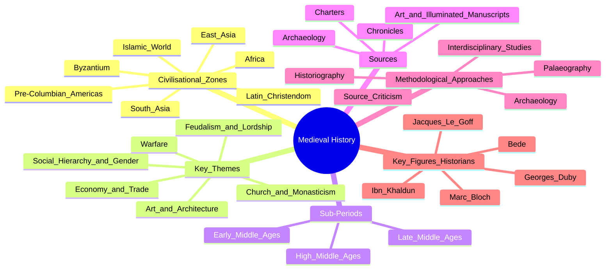

```mermaid
mindmap
  root((Medieval History))
    Civilisational_Zones
      Latin_Christendom
      Byzantium
      Islamic_World
      East_Asia
      South_Asia
      Africa
      Pre‑Columbian_Americas
    Key_Themes
      Feudalism_and_Lordship
      Church_and_Monasticism
      Economy_and_Trade
      Social_Hierarchy_and_Gender
      Art_and_Architecture
      Warfare
    Sub‑Periods
      Early_Middle_Ages
      High_Middle_Ages
      Late_Middle_Ages
    Sources
      Chronicles
      Charters
      Archaeology
      Art_and_Illuminated_Manuscripts
    Methodological_Approaches
      Historiography
      Source_Criticism
      Palaeography
      Archaeology
      Interdisciplinary_Studies
    Key_Figures_Historians
      Bede
      Ibn_Khaldun
      Marc_Bloch
      Georges_Duby
      Jacques_Le_Goff
```

