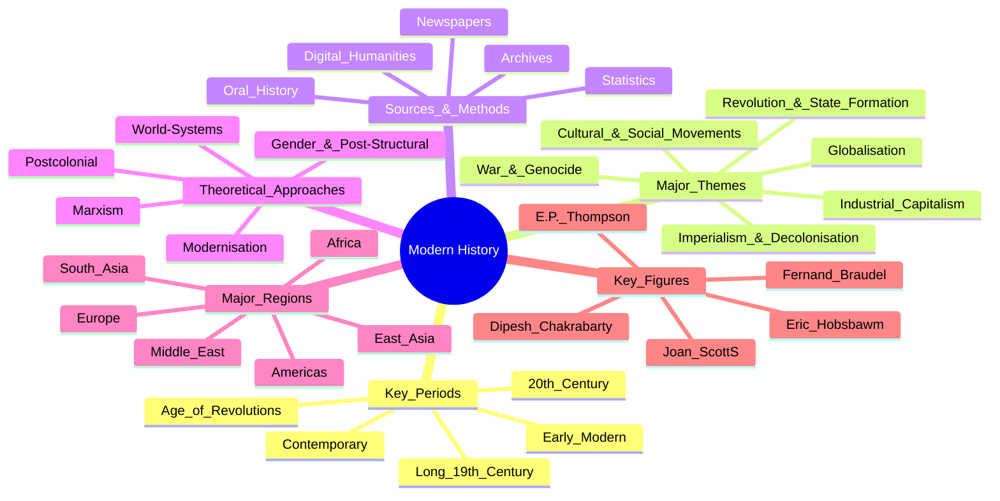

```mermaid
mindmap
  root((Modern History))
    Key_Periods
      Early_Modern
      Age_of_Revolutions
      Long_19th_Century
      20th_Century
      Contemporary
    Major_Themes
      Revolution_&_State_Formation
      Industrial_Capitalism
      Imperialism_&_Decolonisation
      War_&_Genocide
      Cultural_&_Social_Movements
      Globalisation
    Sources_&_Methods
      Archives
      Newspapers
      Statistics
      Oral_History
      Digital_Humanities
    Theoretical_Approaches
      Modernisation
      Marxism
      World‑Systems
      Postcolonial
      Gender_&_Post‑Structural
    Major_Regions
      Europe
      East_Asia
      South_Asia
      Middle_East
      Africa
      Americas
    Key_Figures
      Eric_Hobsbawm
      Fernand_Braudel
      E.P._Thompson
      Dipesh_Chakrabarty
      Joan_ScottS
```

