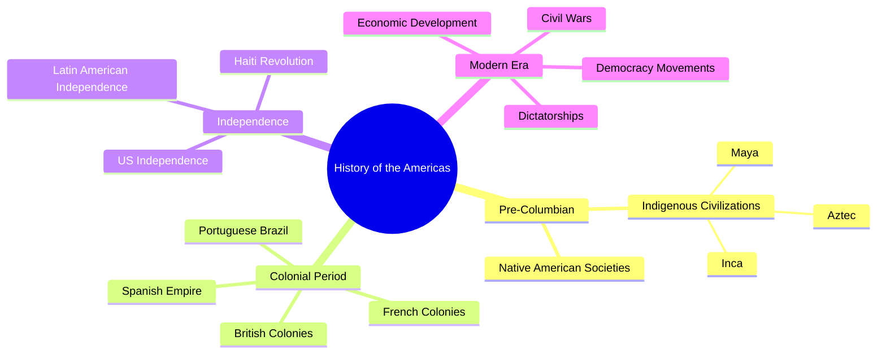

```mermaid
mindmap
  root((History of the Americas))
    Pre-Columbian
      Indigenous Civilizations
        Maya
        Aztec
        Inca
      Native American Societies
    Colonial Period
      Spanish Empire
      Portuguese Brazil
      British Colonies
      French Colonies
    Independence
      Latin American Independence
      US Independence
      Haiti Revolution
    Modern Era
      Civil Wars
      Dictatorships
      Democracy Movements
      Economic Development
```

