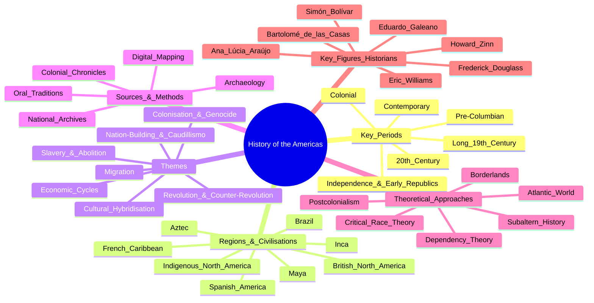

```mermaid
mindmap
  root((History of the Americas))
    Key_Periods
      Pre‑Columbian
      Colonial
      Independence_&_Early_Republics
      Long_19th_Century
      20th_Century
      Contemporary
    Regions_&_Civilisations
      Maya
      Aztec
      Inca
      Spanish_America
      Brazil
      British_North_America
      French_Caribbean
      Indigenous_North_America
    Themes
      Colonisation_&_Genocide
      Slavery_&_Abolition
      Nation‑Building_&_Caudillismo
      Economic_Cycles
      Migration
      Revolution_&_Counter‑Revolution
      Cultural_Hybridisation
    Sources_&_Methods
      Archaeology
      Colonial_Chronicles
      National_Archives
      Oral_Traditions
      Digital_Mapping
    Theoretical_Approaches
      Postcolonialism
      Dependency_Theory
      Atlantic_World
      Borderlands
      Subaltern_History
      Critical_Race_Theory
    Key_Figures_Historians
      Bartolomé_de_las_Casas
      Simón_Bolívar
      Frederick_Douglass
      Eric_Williams
      Eduardo_Galeano
      Howard_Zinn
      Ana_Lúcia_Araújo
```

