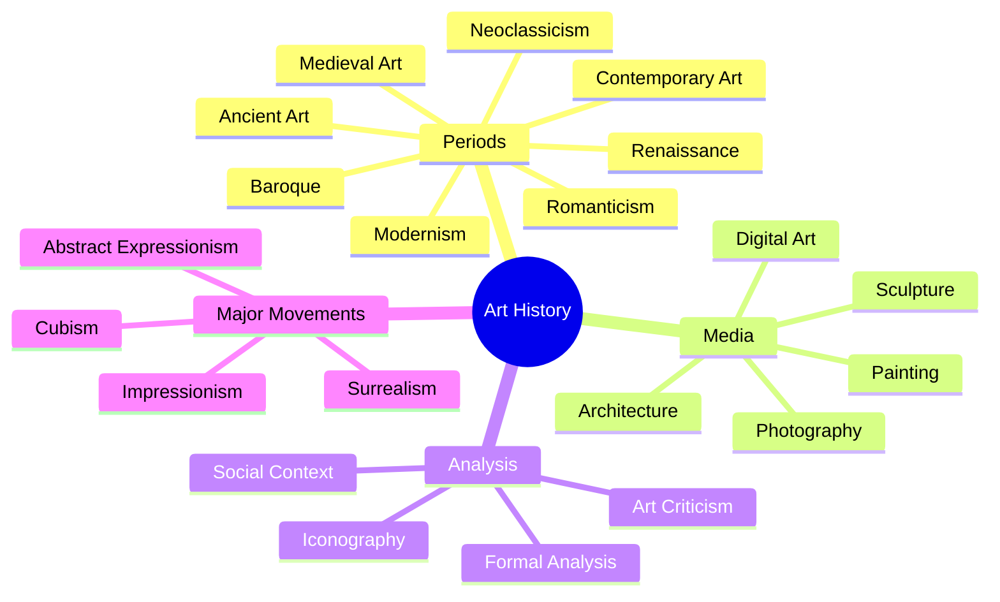

```mermaid
mindmap
  root((Art History))
    Periods
      Ancient Art
      Medieval Art
      Renaissance
      Baroque
      Neoclassicism
      Romanticism
      Modernism
      Contemporary Art
    Media
      Painting
      Sculpture
      Architecture
      Photography
      Digital Art
    Analysis
      Formal Analysis
      Iconography
      Social Context
      Art Criticism
    Major Movements
      Impressionism
      Cubism
      Surrealism
      Abstract Expressionism
```

