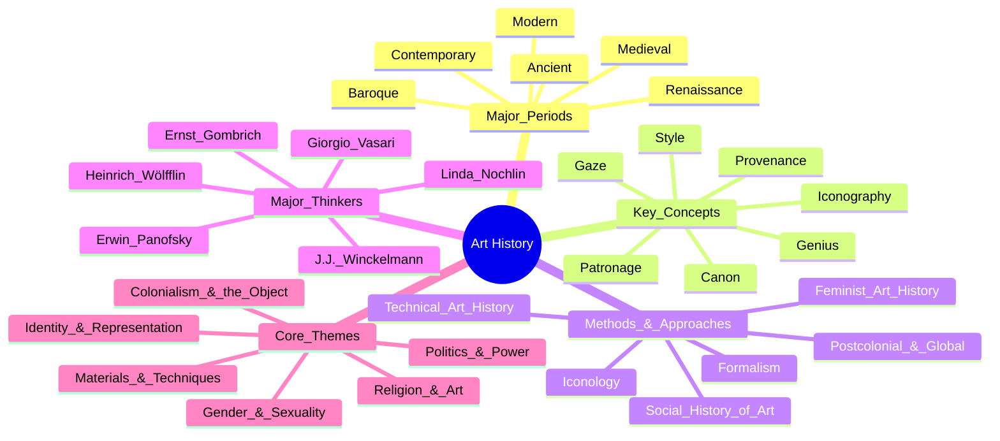

```mermaid
mindmap
  root((Art History))
    Major_Periods
      Ancient
      Medieval
      Renaissance
      Baroque
      Modern
      Contemporary
    Key_Concepts
      Iconography
      Style
      Patronage
      Canon
      Provenance
      Genius
      Gaze
    Methods_&_Approaches
      Formalism
      Iconology
      Social_History_of_Art
      Feminist_Art_History
      Postcolonial_&_Global
      Technical_Art_History
    Major_Thinkers
      Giorgio_Vasari
      J.J._Winckelmann
      Heinrich_Wölfflin
      Erwin_Panofsky
      Ernst_Gombrich
      Linda_Nochlin
    Core_Themes
      Religion_&_Art
      Politics_&_Power
      Identity_&_Representation
      Gender_&_Sexuality
      Colonialism_&_the_Object
      Materials_&_Techniques
```

