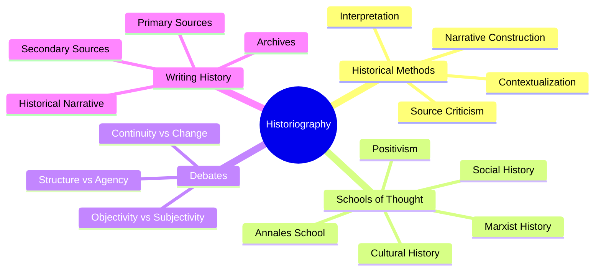

```mermaid
mindmap
  root((Historiography))
    Historical Methods
      Source Criticism
      Contextualization
      Interpretation
      Narrative Construction
    Schools of Thought
      Positivism
      Marxist History
      Annales School
      Social History
      Cultural History
    Debates
      Objectivity vs Subjectivity
      Structure vs Agency
      Continuity vs Change
    Writing History
      Archives
      Primary Sources
      Secondary Sources
      Historical Narrative
```

