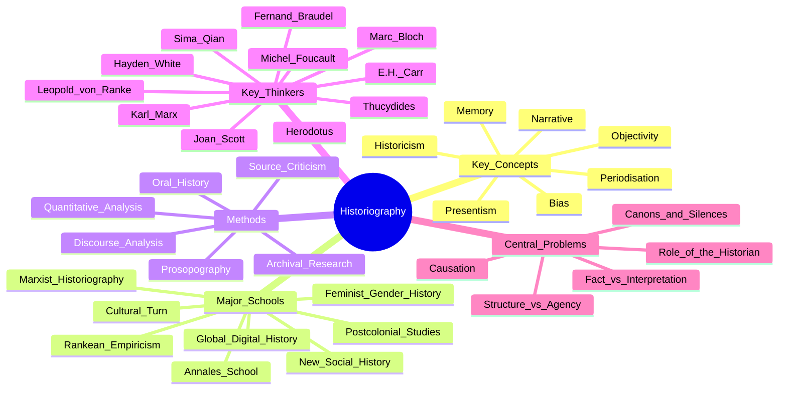

```mermaid
mindmap
  root((Historiography))
    Key_Concepts
      Objectivity
      Bias
      Periodisation
      Narrative
      Memory
      Historicism
      Presentism
    Major_Schools
      Rankean_Empiricism
      Marxist_Historiography
      Annales_School
      New_Social_History
      Cultural_Turn
      Postcolonial_Studies
      Feminist_Gender_History
      Global_Digital_History
    Methods
      Source_Criticism
      Archival_Research
      Quantitative_Analysis
      Oral_History
      Discourse_Analysis
      Prosopography
    Key_Thinkers
      Herodotus
      Thucydides
      Sima_Qian
      Leopold_von_Ranke
      Karl_Marx
      Marc_Bloch
      Fernand_Braudel
      E.H._Carr
      Michel_Foucault
      Hayden_White
      Joan_Scott
    Central_Problems
      Fact_vs_Interpretation
      Causation
      Structure_vs_Agency
      Canons_and_Silences
      Role_of_the_Historian
```

