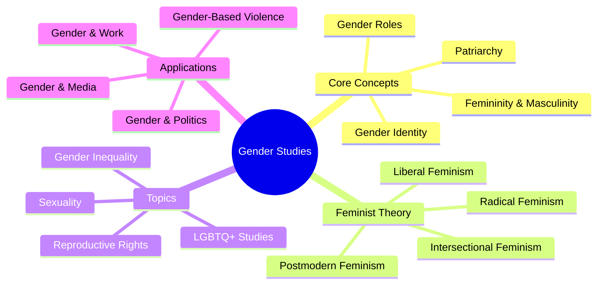

```mermaid
mindmap
  root((Gender Studies))
    Core Concepts
      Gender Identity
      Gender Roles
      Patriarchy
      Femininity & Masculinity
    Feminist Theory
      Liberal Feminism
      Radical Feminism
      Intersectional Feminism
      Postmodern Feminism
    Topics
      Gender Inequality
      Sexuality
      LGBTQ+ Studies
      Reproductive Rights
    Applications
      Gender & Work
      Gender & Politics
      Gender & Media
      Gender-Based Violence
```

