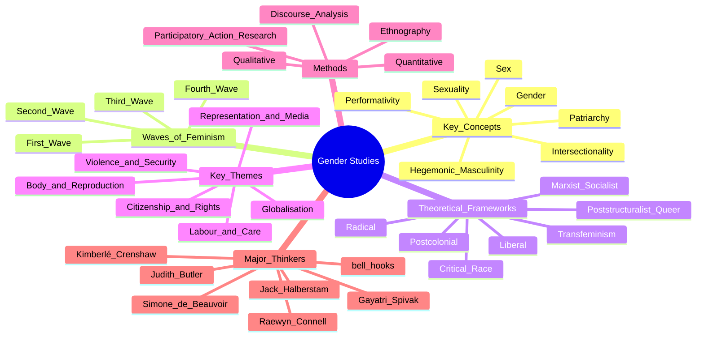

```mermaid
mindmap
  root((Gender Studies))
    Key_Concepts
      Gender
      Sex
      Sexuality
      Patriarchy
      Intersectionality
      Performativity
      Hegemonic_Masculinity
    Waves_of_Feminism
      First_Wave
      Second_Wave
      Third_Wave
      Fourth_Wave
    Theoretical_Frameworks
      Liberal
      Radical
      Marxist_Socialist
      Poststructuralist_Queer
      Critical_Race
      Postcolonial
      Transfeminism
    Key_Themes
      Body_and_Reproduction
      Labour_and_Care
      Representation_and_Media
      Violence_and_Security
      Citizenship_and_Rights
      Globalisation
    Methods
      Qualitative
      Quantitative
      Discourse_Analysis
      Ethnography
      Participatory_Action_Research
    Major_Thinkers
      Simone_de_Beauvoir
      bell_hooks
      Judith_Butler
      Kimberlé_Crenshaw
      Gayatri_Spivak
      Raewyn_Connell
      Jack_Halberstam
```

